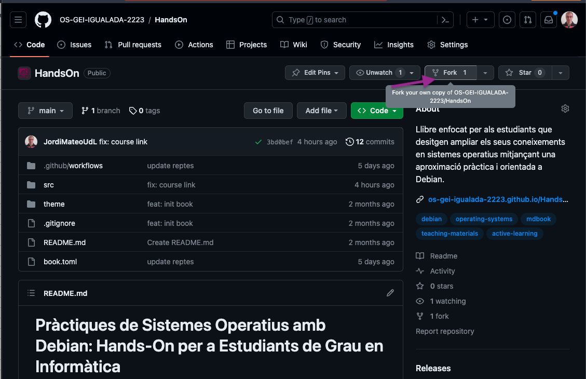
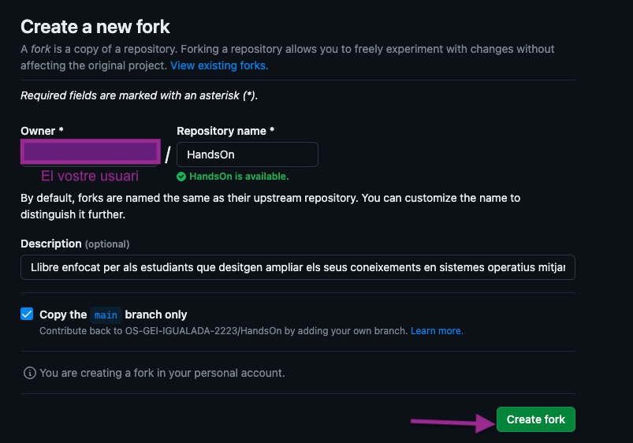
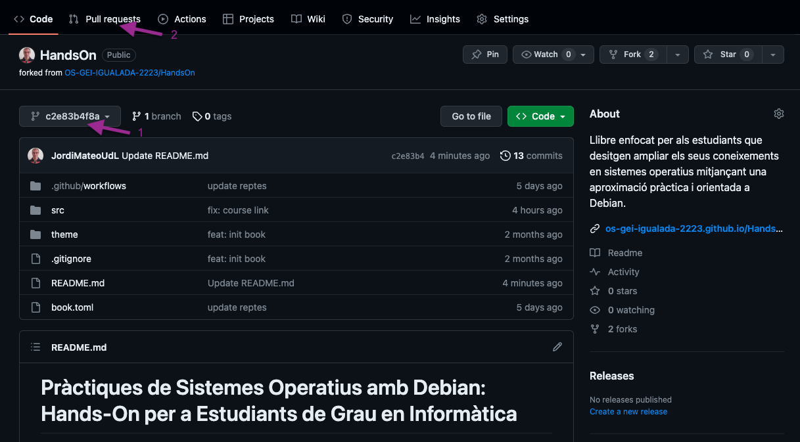
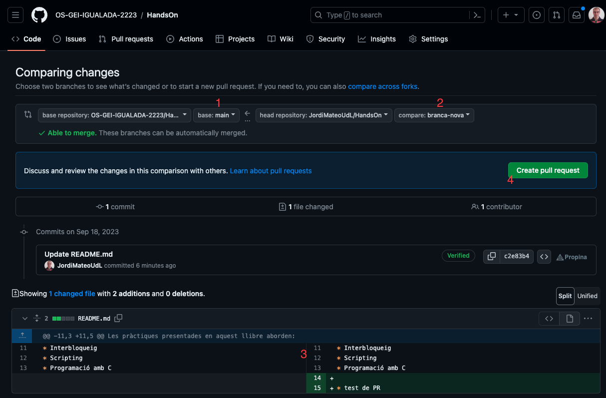

# Contribueix

Aquest material és de codi obert i podeu col·laborar-hi, complementar-lo o corregir-lo mitjançant **pull requests** al repositori. L'objectiu és estendre'n la seva funcionalitat i millorar-ne l'explicació. La vostra contribució és fonamental per fer-lo més complet i útil per a tots els usuaris interessats. M'encantaria veure com colaboreu tots en aquest projecte. Recordeu que la col·laboració activa és **0.5 punts extra a la nota final.**

L'enllaç al repositori és:
[https://github.com/AMSA-2425-GEI-UDL/laboratoris](https://github.com/AMSA-2425-GEI-UDL/laboratoris)

## Instruccions per contribuïr

* **Fork el repositori**: Fes clic al botó **Fork** a la part superior dreta de la pàgina. Això crearà una còpia del repositori al teu compte de GitHub. Veure imatge:





* **Clona el repositori a la teva màquina**: Utilitza Git per clonar el repositori que has clonat a la teva màquina.

* **Crea una branca (branch) nova**: Abans de fer canvis, crea una branca nova on faràs les teves modificacions. Això ajuda a mantenir les coses ordenades. Utilitza la comanda següent:

```bash
git checkout -b nom_de_la_branca
```

* Fes els canvis: Realitza les modificacions necessàries en els fitxers del projecte.

* Afegeix i commiteja els canvis: Utilitza els següents comandos per afegir els canvis i fer un commit.

* Puja els canvis al teu repositori a GitHub amb la comanda següent:

```bash
git push origin nom_de_la_branca
```

* **Crea una PR**: Vés al teu repositori a GitHub i selecciona la branca on has fet els canvis. Apareixerà un missatge destacat dient que has fet una nova branca. Fes clic a "Compare & pull request" per començar la PR. 

També, pots anar a la nova branca fent click al menu desplegable i seleccionant la branca que has creat **1** i fent click al botó **New pull request** **2**. Veure imatge:



* Proporciona una descripció detallada dels canvis que has fet. A més, pots afegir captures de pantalla o informació addicional per ajudar els revisors a entendre els teus canvis. Fes clic a **New pull request** i beuras una pantalla com la següent:



**1** Indica el meu repositori (on vols enviar les modificacions) i **2** indica el teu fork (on has fet les modificacions). Assegura't de seleccionar la branca amb les modificacions **3**. Finalment, fes clic a **Create pull request** **4**.

* **Envia la PR**: Un cop hagis omplert tota la informació, fes clic al botó "Create pull request" per enviar la PR al projecte original.

## Instruccions per instal·lar mdbook

Per instal·lar mdbook, primer cal instal·lar Rust. Podeu trobar les instruccions d'instal·lació a [https://www.rust-lang.org/tools/install](https://www.rust-lang.org/tools/install).

Un cop instal·lat Rust, podeu instal·lar mdbook amb la comanda:

```bash
cargo install mdbook --vers 0.4.37
```

### Edició dels fitxers

Els fitxers es troben en format Markdown. Podeu trobar més informació sobre el format Markdown a [Markdown Guide](https://www.markdownguide.org/basic-syntax/).

### Avaluació dels canvis generant el llibre en format HTML al vostre ordinador

```sh
mdbook serve --open
```

## Utiltizant Docker

Si no voleu instal·lar mdbook al vostre sistema, podeu utilitzar Docker per compilar el llibre. Aquest repositori conté un Dockerfile que us permetrà compilar el llibre sense instal·lar mdbook al vostre sistema.

* Per compilar el llibre, executeu la següent comanda:

    ```bash
    make build
    ```

* Per iniciar un servidor web local al port 3000, executeu la següent comanda:

    ```bash
    make run
    ```

* Per aturar el servidor web, executeu la següent comanda:

    ```bash
    make stop
    ```

* Per eliminar el contenidor, executeu la següent comanda:

    ```bash
    make clean
    ```
