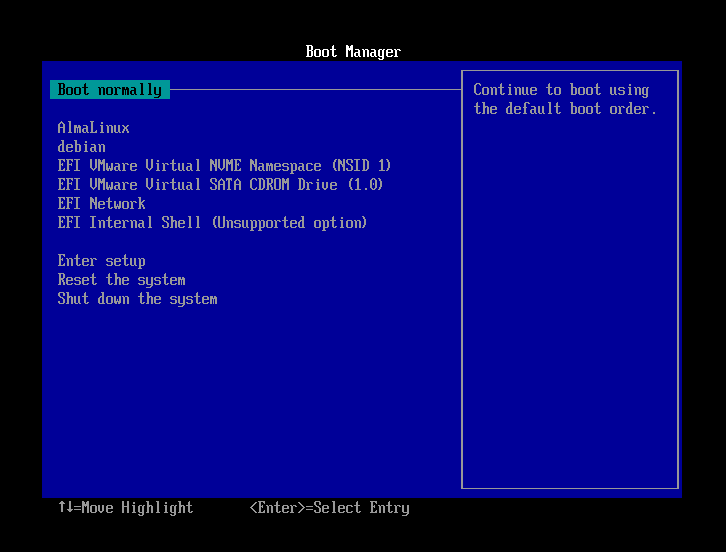

# Anàlisi del procediment

El **GRUB** és un gestor d’arrancada que es configura automàticament durant la instal·lació d’un sistema operatiu. Quan instal·les un nou sistema operatiu, l’instal·lador detecta altres sistemes operatius presents en el mateix disc dur i crea entrades per a cada sistema operatiu en el fitxer de configuració del GRUB. Aquestes entrades permeten seleccionar quin sistema operatiu volem carregar durant l’arrancada del sistema.

A més, durant la instal·lació d’un nou sistema operatiu, es crea una nova entrada a la UEFI per a poder iniciar aquest nou sistema operatiu. Aquesta entrada s’ha creat amb la informació del nou GRUB, de manera que aquest conté les entrades dels dos sistemes operatius.

Si accediu a l’entrada inicial de la UEFI (*debian*), veureu que el GRUB únicament conté el sistema operatiu que teníem instal·lat inicialment. En canvi, si accediu a l’entrada nova de la UEFI (*almalinux*), veureu que el GRUB conté els dos sistemes operatius.

> **👁️ Observació**:
>
> Quan instal·les un sistema operatiu Windows després d’un sistema operatiu GNU/Linux, el GRUB es sobreescriu pel carregador d’arrancada de Windows. Això significa que no podràs accedir al sistema operatiu GNU/Linux des del GRUB. Per poder accedir al sistema operatiu GNU/Linux, hauràs de restaurar el GRUB. Aquesta restauració es pot realitzar mitjançant una unitat d’arrancada en viu (live boot) i utilitzant eines com ara `boot-repair`.

Si compareu el grub de debian amb el d'almalinux, veure que estan organitzats de manera diferent. Això és degut a que cada distribució GNU/Linux té la seva pròpia configuració del GRUB. A més, cada distribució GNU/Linux pot utilitzar diferents versions del GRUB, amb diferents opcions i configuracions.
