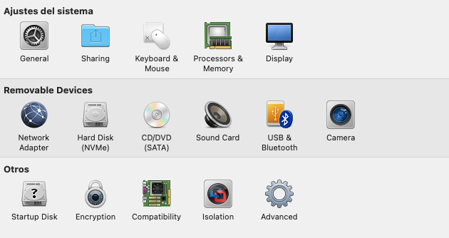
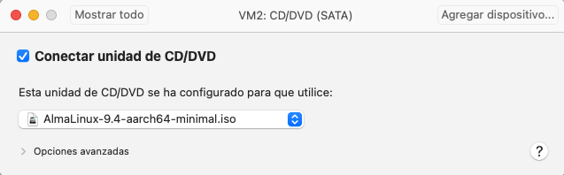
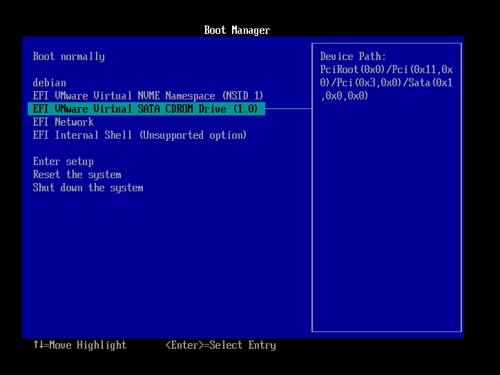
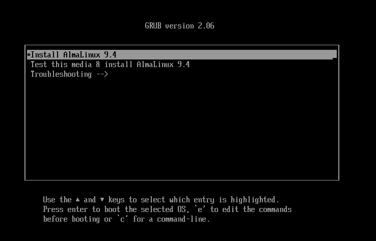
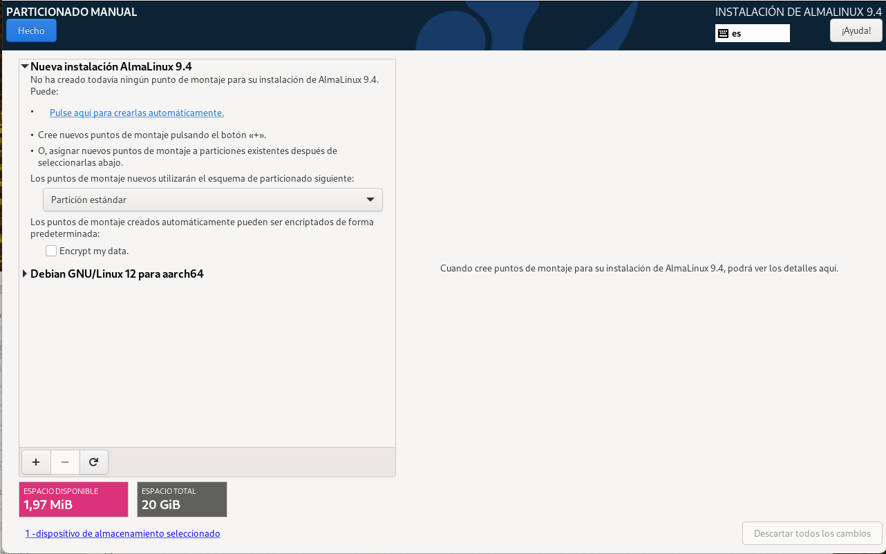
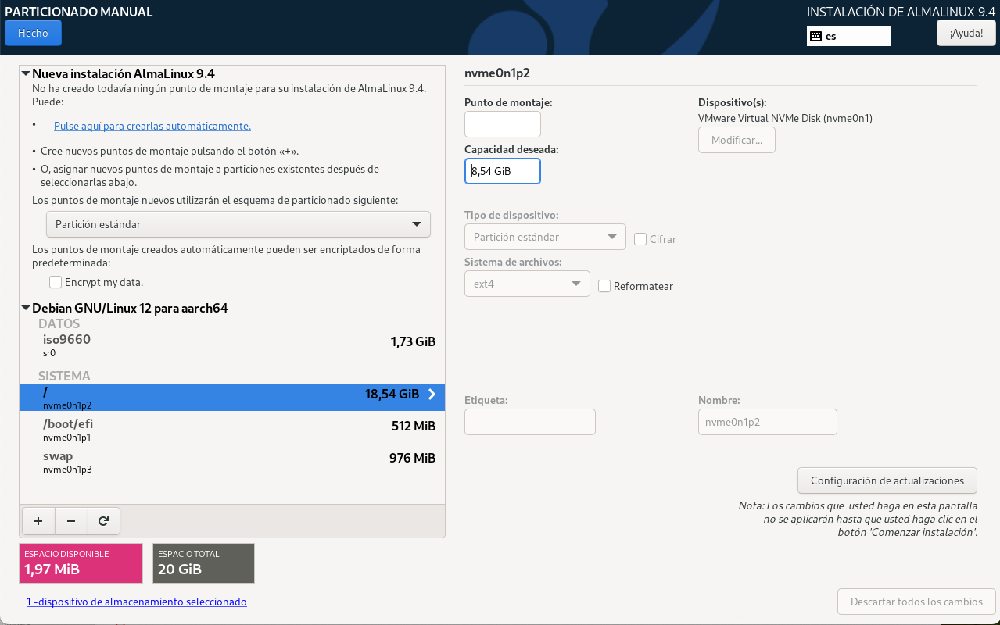
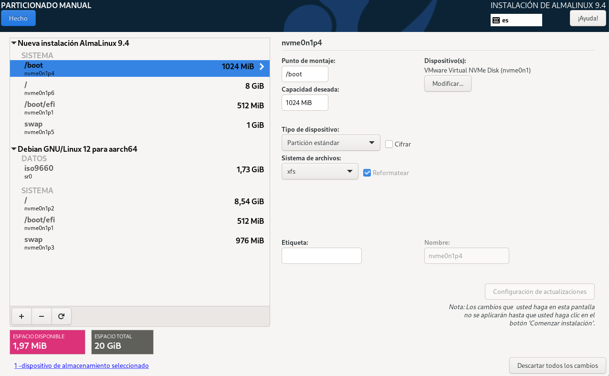
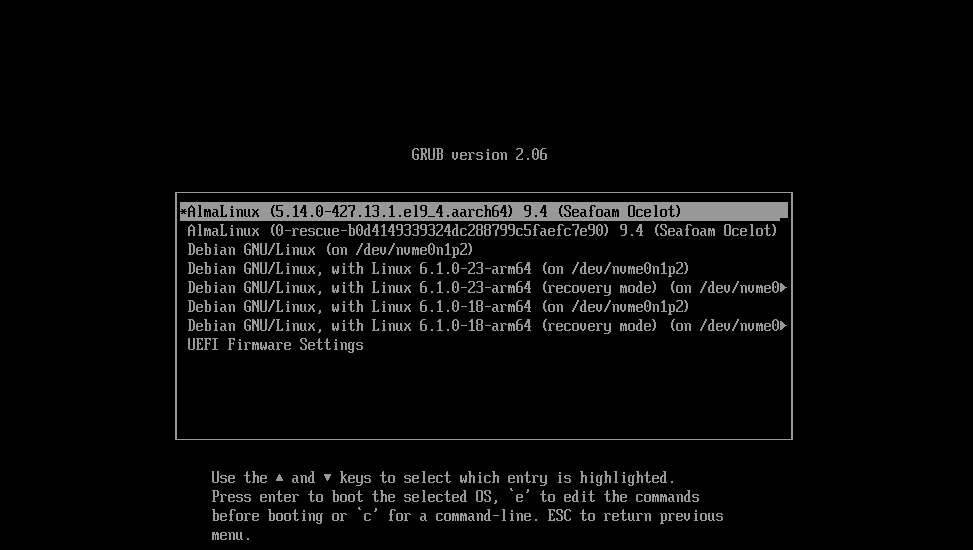

# Dual Boot

En aquesta tasca, configurarem el GRUB per a poder arrancar amb dos sistemes operatius diferents. Per a fer-ho, utilitzarem la màquina virtual on ja tenim instal·lat un sistema operatiu GNU/Linux. A continuació, instal·larem un segon sistema operatiu i configurarem el GRUB per a poder arrancar amb els dos sistemes operatius.

1. **Muntatge de la iso a la màquina virtual**. *A continuació es mostra el procediment per VMWare, adapatar-lo al vostre hypervisor*.

    1. Accedeix a la màquina virtual on tens instal·lat un sistema operatiu GNU/Linux.
    2. Selecciona la màquina virtual i apaga-la.
    3. Prem el boto en forma d'eina 🔧 per a obrir la configuració de la màquina virtual.
        
    4. A la pestanya `CD/DVD (SATA)`, selecciona la opció `Use ISO image file` i selecciona la imatge ISO del sistema operatiu que vols instal·lar.
        
    5. Prem la tecla `OK` per a tancar la finestra de configuració de la màquina virtual.

2. **Arrancada de la màquina virtual amb la iso**.

    1. Inicia la màquina virtual.
    2. Accedeix a la configuració UEFI.
    3. Selecciona el CD-ROM com a dispositiu d'arrancada.
        
    4. Accedeix al GRUB amb la imatge ISO del sistema operatiu que vols instal·lar. En aquest cas, Almalinux 9.4.
        

3. **Instal·lació del sistema operatiu**.

    1. Segueix els passos d'instal·lació del sistema operatiu. 
        - Selecciona **Destino de la instalación** i prem **Personalitzada**.
        - En aquest punt, el nostre disc virtual de 20 GB, té 4 particions ocupant tot l'espai.
            
        - Per poder instal·lar el nou sistema operatiu haurem de reimensionar la partició **(/)** per alliberar espai per a la nova partició, en el nostre cas podem alliberar 10 GB. La partició **(/)** es redueix de 18,54 GB a 8,54 GB. *Simplement heu de modificar el valor númeric com mostro a la imatge*.
            
        - Seleccioneu **Partición estándar** i premeu **Pulse aqui para crearlas automáticamente**.
            

    2. Assigna una contrasenya a l'usuari root i finalitza la instal·lació.

4. **Test de l'arrancada del sistema**.

    1. Reinicia la màquina virtual.
    2. Accedeix al GRUB i comprova que pots seleccionar el sistema operatiu que vols arrancar.
        
    3. Selecciona el sistema operatiu que has instal·lat i comprova que pots iniciar-lo correctament.
