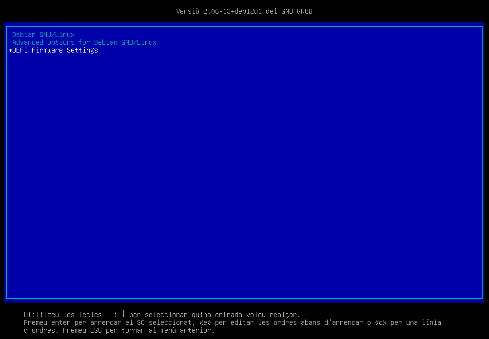
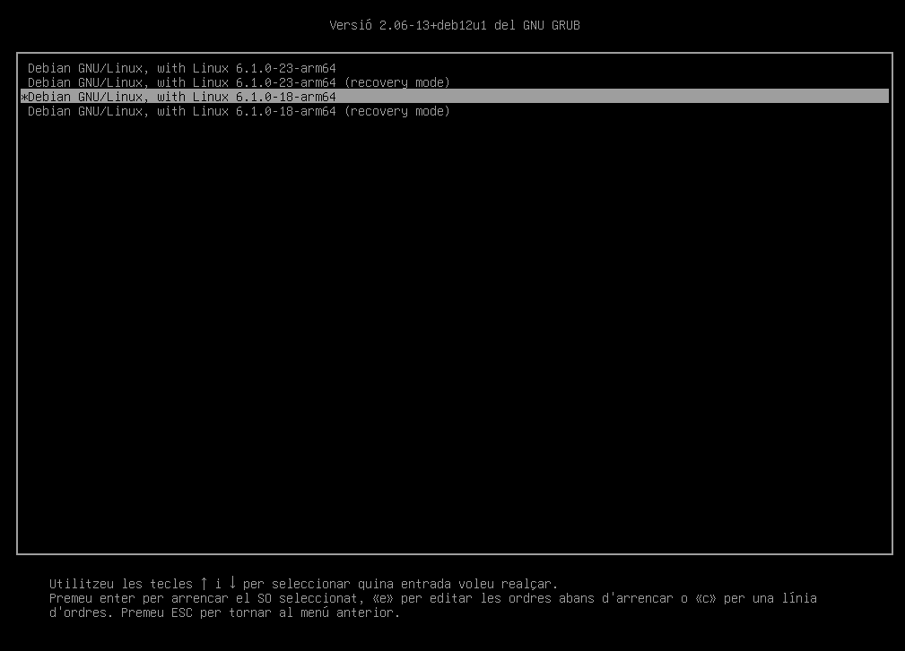
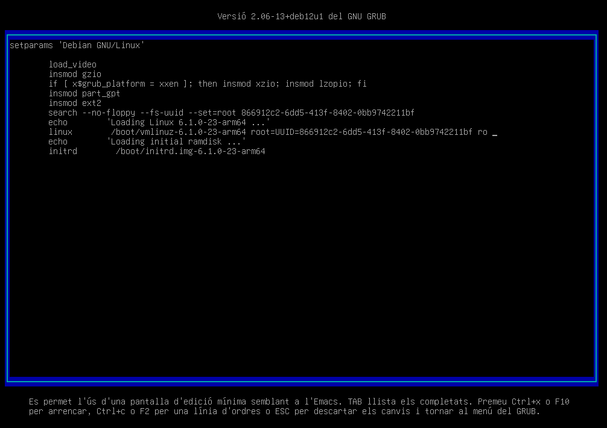

# Modificació de les opcions del GRUB

Com heu pogut observar, la instal·lació del sistema operatiu Debian 12 ha configurat el GRUB de forma predeterminada.



En aquesta pantalla, podeu observar 3 entrades:

1. **Debian GNU/Linux**. Aquesta és l'entrada per defecte que carrega el sistema operatiu Debian 12.
2. **Advanced options for Debian GNU/Linux**. Aquesta entrada permet seleccionar una versió específica del kernel per a carregar.

   

   En el nostre cas, podem seleccionar entre la versió 6.1.0-23 i la 6.1.0-18 ambdues amb les opcions `recovery mode`.

    > **ℹ️ Què és el mode de recuperació?**
    >
    > El mode de recuperació és un mode d'arrancada que carrega el sistema amb un conjunt de paràmetres mínims. Això permet accedir al sistema en un estat més bàsic i realitzar tasques de manteniment o recuperació del sistema.

3. **UEFI Firmware Settings**. Aquesta entrada permet accedir a la configuració de la UEFI.

## Modificació de les opcions del GRUB (temporal)

Seleccioneu l'entrada `Debian GNU/Linux` i premeu la tecla `e` per a editar les opcions de l'arrencada de forma temporal, és a dir, aquestes opcions només es mantindran durant l'arrencada actual del sistema.


En aquesta pantalla, podeu observar les opcions de l'arrencada del sistema. Si analitzem la informació tenim:

1. Carreguem els mòduls del kernel:

    > **ℹ️ Per què carreguem aquests mòduls?**
    >
    > Els mòduls del kernel són programes que s'executen en l'espai del nucli del sistema operatiu. Aquests mòduls permeten al sistema operatiu interactuar amb el maquinari de l'ordinador. En aquest cas, carreguem els mòduls necessaris per a interactuar amb el disc dur i el sistema de fitxers.

   - **load_video**: Aquest mòdul s’encarrega de la inicialització del subsistema de vídeo. És necessari per a la correcta visualització de la interfície gràfica durant l’arrancada.
   - **insmod gzio**:  Aquest mòdul permet al kernel llegir fitxers comprimits en format gzip. És útil per a carregar imatges del kernel o del sistema d’inicialització que estiguin comprimits.
   - **insmod part_gpt**: Aquest mòdul permet al kernel llegir particions de disc que utilitzen la taula de particions GUID (GPT). GPT és un estàndard modern per a la disposició de la taula de particions en un disc dur.
   - **insmod ext2**: Aquest mòdul permet al kernel llegir i escriure en sistemes de fitxers ext2. Ext2 és un sistema de fitxers comú en Linux, encara que ara s’utilitza menys en favor de ext3 i ext4.

2. Indiquem el dispositiu on es troba el sistema operatiu:
   - search --no-floppy --fs-uuid --set=root xxxxxxxx-xxxx-xxxx-xxxx-xxxxxxxxxxxx

    on `xxxxxxxx-xxxx-xxxx-xxxx-xxxxxxxxxxxx` és l'identificador únic del dispositiu on es troba el sistema operatiu.

3. Carreguem el kernel del sistema operatiu;

    - linux /boot/vmlinuz-6.1.0.23-arm64 root=UUID=xxxxxxxx-xxxx-xxxx-xxxx-xxxxxxxxxxxx ro quiet

    on les opcions són:

    - `ro`: indica que el sistema s'ha de muntar en mode de només lectura.
    - `quiet`: indica que el sistema s'ha de carregar sense mostrar missatges.
  
4. Finalment, carreguem el sistema d'inicialització:

    - initrd /boot/initrd.img-6.1.0.23-arm64
  
    > **ℹ️ Què és el sistema d'inicialització?**
    >
    > El sistema d'inicialització és el primer procés que s'executa en un sistema operatiu. En el cas de GNU/Linux, el sistema d'inicialització més comú és el systemd. Aquest sistema d'inicialització s'encarrega de carregar els serveis i els daemons del sistema operatiu.

Modifiquem les opcions de l'arrencada per mostrar els missatges del sistema durant l'arrencada. Per a fer-ho, eliminem l'opció `quiet` de la línia `linux` i premem la tecla  `ctrl+x` o `F10` per a iniciar el sistema amb les opcions modificades.



Ara, el sistema mostrarà els missatges durant l'arrencada.

## Modificació de les opcions del GRUB (permanent)

Aquestes opcions només es mantindran durant l'arrencada actual del sistema. Per a fer que aquestes opcions es mantinguin de forma permanent, haurem de modificar el fitxer de configuració del GRUB. Aquest fitxer normalment es troba a `/etc/default/grub`.

1. Accedeix al sistema amb l'usuari root.
2. Fes una còpia de seguretat del fitxer de configuració del GRUB.

    ```bash
    cp /etc/default/grub /etc/default/grub.bak
    ```

3. Edita el fitxer de configuració del GRUB amb un editor de text com `vi`.

    ```bash
    vi /etc/default/grub
    ```

    Observareu un fitxer similar al:
    

4. Busca la línia que comença amb `GRUB_CMDLINE_LINUX_DEFAULT` i modifica-la per a afegir les opcions que vulguis. Per exemple, per a mostrar els missatges del sistema durant l'arrencada, elimina l'opció `quiet`.

    > **💡 Nota**:
    >
    > Les opcions del GRUB es separen per espais. Per a afegir una nova opció, simplement afegeix-la a la llista separada per un espai.

    ---

    > **🔍 Pregunta**: *Quines altres opcions podries afegir al fitxer de configuració del GRUB?*
    >
    > Algunes opcions comunes que es poden afegir al fitxer de configuració del GRUB són:
    > - `GRUB_TIMEOUT`: temps d'espera per a seleccionar una entrada del GRUB.
    > - `GRUB_DISABLE_OS_PROBER`: per defecte, en debian es troba activada. Per tant, no detectarà altres sistemes operatius instal·lat en el sistema.

5. Desa els canvis i surt de l'editor de text.
6. Un cop hagis modificat el fitxer de configuració del GRUB, hauràs de regenerar el fitxer de configuració del GRUB amb la comanda següent:

    ```bash
    update-grub
    ```

    Aquesta comanda regenerarà el fitxer de configuració del GRUB amb les opcions que has definit. Aquest fitxer es troba a `/boot/grub/grub.cfg`. Pots veure el contingut d'aquest fitxer amb la comanda següent:

    ```bash
    less /boot/grub/grub.cfg
    ```

    > **⚠️ Compte**:
    >
    > No modifiquis manualment el fitxer `/boot/grub/grub.cfg`. Aquest fitxer es genera automàticament amb la comanda `update-grub` i qualsevol modificació manual es sobreescriurà en la propera generació del fitxer.

7. Reinicia el sistema per a aplicar els canvis.

    ```bash
    reboot
    ```

Un cop reiniciat el sistema, el GRUB carregarà el sistema amb les opcions que has definit. Ara, el sistema mostrarà els missatges durant totes les arrencades.
