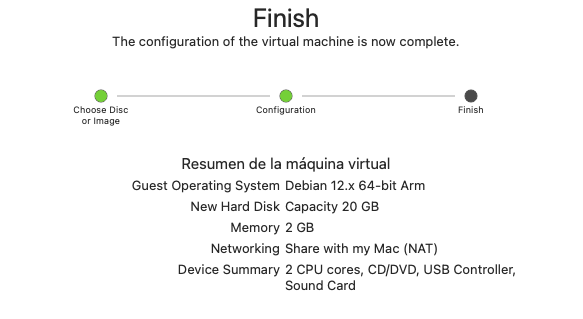
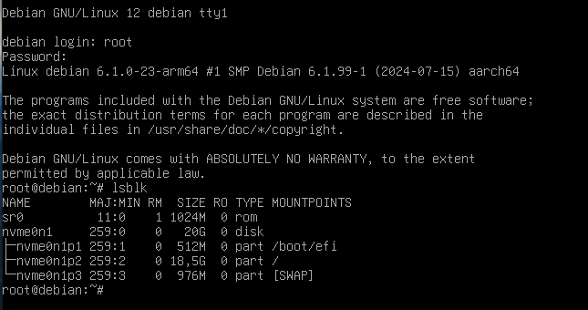

# initramfs

La **initramfs** (intial RAM filesystem) és un sistema de fitxers temporal que es munta a la arrel del sistema de fitxers (rootfs) durant el procés d'arrencada del sistema. La initramfs s'utilitza per realitzar tasques d'inicialització del sistema abans que el sistema de fitxers arrel real estigui disponible. Per exemple, la initramfs pot ser utilitzada per carregar mòduls del nucli, muntar dispositius de bloc, o realitzar tasques de configuració de xarxa.

> **Quin és el funcionament de la initramfs?**
>
> La initramfs és un arxiu comprimit que conté un sistema de fitxers mínim necessari per inicialitzar el sistema. Aquest arxiu es descomprimeix a la memòria RAM durant l'arrencada i s'utilitza com el sistema de fitxers arrel temporal. La initramfs inclou scripts i binaris essencials que permeten al sistema realitzar tasques crítiques abans que el sistema de fitxers arrel real estigui disponible.

Hi ha diverses situacions en les quals un administrador de sistemes podria necessitar modificar la initramfs:

- **Inclusió de mòduls del nucli addicionals**: Si el sistema requereix mòduls del nucli que no estan inclosos en la initramfs per defecte, com controladors de xarxa, controladors d'emmagatzematge, o sistemes de fitxers específics (per exemple, Btrfs o ZFS), serà necessari modificar la initramfs per incloure aquests mòduls.
  
- **Configuració de dispositius d'emmagatzematge complexos**: Si el sistema utilitza configuracions d'emmagatzematge complexes, com RAID o LVM, pot ser necessari incloure scripts i binaris addicionals en la initramfs per assegurar que aquests dispositius siguin correctament inicialitzats i muntats.
  
- **Configuració de xarxa**: En alguns casos, pot ser necessari incloure scripts de configuració de xarxa en la initramfs per assegurar que el sistema tingui accés a la xarxa durant el procés d'arrencada. Això pot ser útil en entorns on la xarxa és essencial per l'arrencada del sistema.
  
- **Solucionar problemes d'arrencada**: Si el sistema experimenta problemes d'arrencada, modificar la initramfs pot ser una solució per incloure scripts de diagnòstic o correccions temporals que permetin al sistema arrencar correctament.

En aquest laboratori, explorarem com podem examinar i modificar la initramfs en un sistema Linux basat en Debian. Per a més informació sobre la initramfs, podeu consultar la documentació oficial de Debian a [Debian Wiki - Initramfs](https://wiki.debian.org/Initramfs).

## Objectius

- Entendre què és la initramfs i com funciona.
- Aprendre a examinar el contingut de la initramfs.
- Aprendre a modificar la initramfs per incloure mòduls del nucli addicionals.

## Preparació

1. **Entorn de treball**: Màquina virtual amb una distribució GNU/Linux instal·lada pot ser Debian o AlmaLinux. La màquina virtual pot tenir una configuració per defecte. Característiques de la màquina virtual:

    - Disc dur virtual de 20 GB.
    - 1 CPU.
    - 1 GB de memòria RAM.

    

    A més, inicialitzeu com a mínim un usuari **root** amb contrasenya (pot ser *1234*).

    

> En el meu cas he utilitzat una màquina virtual amb la imatge de **Debian 12** proporcionada al inici de curs al campus virtual.

## Tasques

1. [Examinar el contingut de la initramfs](./initramfs/examinant.md)
2. [Carregar un mòdul del nucli addicional a la initramfs](./initramfs/carregant.md)
3. [Personalitzar la initramfs](./initramfs/personalitzar.md)
