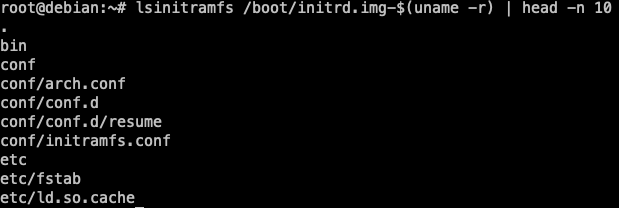

# Examinant la initramfs

1. **Inicia la màquina virtual**: Inicia la màquina virtual i inicia sessió amb l'usuari **root**.
2. **Examina el contingut de la initramfs**: Utilitza la comanda `lsinitramfs` per examinar el contingut de la initramfs. Aquesta comanda mostrarà el contingut de la initramfs i els scripts i binaris que s'executen durant el procés d'arrencada.

    ```bash
    lsinitramfs /boot/initrd.img-$(uname -r)
    ```

    

    En la figura anterior, he limitat la sortida amb la comanda `head` per mostrar només les 10 primeres línies de la sortida. La sortida completa mostrarà tot el contingut de la initramfs.

    Si analitzeu la sortida completa al vostre servidor, podreu veure que la initramfs conté diversos scripts i binaris que s'utilitzen durant el procés d'arrencada. Aquests scripts i binaris són responsables de realitzar tasques com muntar dispositius de bloc, carregar mòduls del nucli, i configurar la xarxa.

    > 💡 **Nota**: La sortida de la comanda `lsinitramfs` pot ser molt extensa, ja que la initramfs conté molts scripts i binaris necessaris per l'arrencada del sistema. Si voleu veure la sortida completa, podeu redirigir-la a un fitxer o utilitzar la comanda `less` per navegar-hi.

3. Cerca si el modul `ext4` està present a la initramfs:

    ```bash
    lsinitramfs /boot/initrd.img-$(uname -r) | grep ext4
    ```

    En aquest cas, hauria de veure que el mòdul `ext4` està present a la initramfs. Aquest mòdul és necessari per muntar sistemes de fitxers ext4 durant el procés d'arrencada.

    
