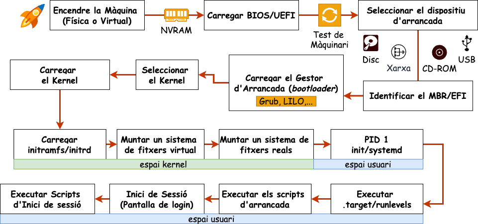

# Arrancada del sistema

Quan arranquem un ordinador, tenen lloc una sèrie de processos que permeten que el sistema operatiu es carregui i es posi en marxa. Aquests processos són els que es coneixen com a arrancada del sistema. En un sistema linux, la seqüència d'arrancada es pot dividir en les següents fases:

1. **Càrrega del BIOS o UEFI**. Quan encenem l'ordinador, el primer programa que s'executa està emmagatzemat en una memòria no volàtil (NVRAM). Aquest programa pot ser el BIOS (Basic Input/Output System) en sistemes més antics o l'UEFI (Unified Extensible Firmware Interface) en sistemes més moderns. Aquest firmware és el responsable de gestionar les funcions bàsiques del sistema abans de carregar el sistema operatiu.

2. **Test de l'ordinador**. El BIOS o l'UEFI realitza un test de l'ordinador per assegurar-se que tots els components funcionen correctament. Aquest test s'anomena **POST (Power-On Self Test)**. Si el test falla, l'ordinador emet una sèrie de senyals acústics o visuals per indicar quin component ha fallat.

3. **Selecció del dispositiu d'arrancada**. El BIOS o l'UEFI permet triar quin dispositiu volem utilitzar per a carregar el sistema operatiu. Aquest dispositiu pot ser el *disc dur, un dispositiu USB, un CD-ROM, etc.*.

4. **Identificació de la partició d'arrancada**. El BIOS o UEFI localitza la partició d'arrencada del dispositiu seleccionat. En sistemes amb BIOS, es fa servir el Master Boot Record (MBR), mentre que en sistemes amb UEFI es fa servir la taula de particions GUID (GPT) per identificar la partició correcta (normalment, anomenada EFI). Aquesta partició conté el gestor d'arrencada i altres fitxers necessaris per continuar el procés d'arrencada.

5. **Càrrega del gestor d'arrancada**. El BIOS o UEFI carrega el gestor d'arrencada. El gestor d'arrancada és un petit programa que permet triar quin sistema operatiu volem carregar. Els gestors d'arrencada més comuns en sistemes Linux són **GRUB** (Grand Unified Bootloader) o **LILO** (Linux Loader). Aquests gestors d'arrancada mostren una llista amb els sistemes operatius disponibles i permeten triar-ne un.

6. **Càrrega del kernel**.  En aquesta fase, el gestor d'arrancada descomprimeix el codi del nucli i el carrega a la memòria.

7. **Càrrega del sistema de fitxers inicial**. El nucli carrega un sistema de fitxers inicial (initramfs o initrd) que conté els mòduls i els programes necessaris per muntar el sistema de fitxers real del sistema operatiu.

8. **Sistema d'inicialització**. És el primer procés que s'executa en un sistema operatiu en l'espai usuari. En el cas de GNU/Linux, el sistema d'inicialització més comú és el **systemd**. Una altre gestor d'arrancada, més vell però molt utilitzat és el **SysVInit (Init)**.

9. **Execució dels targets o runlevels**. El sistema d'inicialització carrega els diferents targets o runlevels, que defineixen l'estat del sistema en un moment determinat. Aquests runlevels poden ser diferents nivells d'arrencada, com arrencada en mode gràfic o mode de recuperació. Cada runlevel pot tenir diferents serveis i daemons activats o desactivats.

10. **Execució dels scripts d'arrancada**. El sistema d'inicialització executa els scripts d'arrancada definits per a cada runlevel. Aquests scripts són responsables de configurar els serveis i daemons del sistema, com ara la xarxa, els dispositius de maquinari, els sistemes de fitxers, entre altres.

11. **Inici de la Sessió d'Usuari**. Finalment, el sistema està preparat per a l'usuari. Si el sistema està configurat per a un entorn gràfic, es carrega el gestor de finestres o l'entorn d'escriptori. En sistemes sense entorn gràfic, es presenta una línia de comandes. En aquest punt, l'usuari pot iniciar sessió i començar a utilitzar el sistema.

12. **Execució dels scripts d'inici de sessió**. Un cop iniciada la sessió, s'executen els scripts d'inici de sessió de l'usuari. Aquests scripts poden configurar variables d'entorn, carregar programes o configurar preferències de l'usuari. Això permet personalitzar l'experiència de l'usuari i preparar l'entorn de treball.

En aquest laboratori veurem totes aquestes fases en una màquina virtual i modificarem els parametres per veure com afecten als sistemes.

## Objectius

- Entendre com funciona el procés d'arrancada del sistema.
- Conèixer els diferents components implicats en l'arrancada del sistema.
- Apendre a gestionar i optimitzar el procés d'arrancada.

## Continguts

1. [UEFI i dispositius d'arrancada](./uefi.md)
2. [GRUB](./grub.md)
3. [initramfs](./initramfs.md)
4. [Inici del sistema i Dimonis de gestió de serveis](./systemd.md)

## Activitats

**Realització de les tasques**: 50%

S'ha de mostrar en un document amb format lliure les evidències de la realització de les tasques. Aquest document es pot incloure al informe tècnic o es pot lliurar com a document adjunt. En aquest document heu de mostrar les dificultats trobades i com les heu resolt. Us recomano que feu servir eines de captura de pantalla per a mostrar les evidències. Per exemple, podeu incloure una secció anomenada **Troubleshooting** on mostreu les dificultats trobades i com les heu resolt.

**Informe tècnic**: 50%

El informe tècnic ha de contenir respostes a les preguntes plantejades a continuació:

1. **Investigació d'una unitat del sistema**
   - Elegeix una unitat del sistema, com ara `ssh.service`, i investiga la seva funció i configuració.
   - Utilitza les comandes `systemctl status` i `systemctl cat` per obtenir més informació sobre la unitat.
   - Inclou a l'informe  els resultats de la teva investigació:
     - Descripció de la unitat.
     - Documentació associada.
     - Dependències i condicions.
     - Tipus de servei i comandaments d'inici i parada.
     - Temps d'execució i estat actual.

2. **Comparació entre arrencada amb i sense interfície gràfica**
   - Instal·la la interfície gràfica utilitzant la comanda `tasksel` i selecciona l'opció `Debian desktop environment`.
   - Compara el temps d'arrencada del sistema amb i sense interfície gràfica utilitzant la comanda `systemd-analyze`.
   - Inclou al informe de la diferència entre arrencar el sistema amb una interfície gràfica i sense interfície gràfica, incloent:
     - Temps d'arrencada del kernel i l'espai d'usuari.
     - Unitats crítiques i temps d'arrencada.
     - Avantatges i desavantatges de cada configuració

3. **Dissenyeu un escenari real on un script d'arrancada podria ser útil**
   - Pensa en un escenari real on un script d'arrancada podria ser útil per configurar l'entorn de l'usuari.
   - Crea un script d'arrancada que realitzi una tasca específica en aquest escenari.
   - Configura el script d'arrancada perquè s'executi automàticament quan un usuari inicia una sessió de terminal.
   - Inclou a l'informe amb els detalls de l'escenari i el script d'arrancada, incloent:
     - Descripció de l'escenari i la tasca a realitzar.
     - Contingut del script d'arrancada.
     - Configuració del script d'arrancada per a l'usuari.

## Rúbriques d'avaluació

| Criteris d'avaluació      | Excel·lent (5) | Notable(3-4) | Acceptable(1-2)  | No Acceptable (0) |
|---------------------------|----------------|--------------|------------------|-------------------|
| Contingut                 | El contingut és molt complet i detallat. S'han cobert tots els aspectes de la tasca. | El contingut és complet i detallat. S'han cobert la majoria dels aspectes de la tasca. | El contingut és incomplet o poc detallat. Falten alguns aspectes de la tasca. | El contingut és molt incomplet o inexistent.|
| Precisió i exactitud       | La informació és precisa i exacta. No hi ha errors. | La informació és precisa i exacta. Hi ha pocs errors. | La informació és imprecisa o inexacta. Hi ha errors. | La informació és molt imprecisa o inexacta. Hi ha molts errors. |
| Organització              | La informació està ben organitzada i estructurada. És fàcil de seguir. | La informació està organitzada i estructurada. És fàcil de seguir. | La informació està poc organitzada o estructurada. És difícil de seguir. | La informació està molt poc organitzada o estructurada. És molt difícil de seguir. |
| Diagrames i il·lustracions | S'han utilitzat diagrames i il·lustracions de collita pròpia per aclarir la informació. Són molt útils. | S'han utilitzat diagrames i il·lustracions de collita pròpia per aclarir la informació. Són útils. | S'han utilitzat pocs diagrames o il·lustracions de collita pròpia. Són poc útils. | No s'han utilitzat diagrames o il·lustracions de collita pròpia.|
| Plagi                     | No hi ha evidències de plagi. Tota la informació és original. | Hi ha poques evidències de plagi. La majoria de la informació és original. | Hi ha evidències de plagi. Alguna informació no és original. | Hi ha moltes evidències de plagi. Poca informació és original. |
| Bibliografia              | S'ha inclòs una bibliografia completa i detallada. | S'ha inclòs una bibliografia completa. | S'ha inclòs una bibliografia incompleta. | No s'ha inclòs una bibliografia. |
| Estil                     | L'estil és molt adequat i professional. S'ha utilitzat un llenguatge tècnic precís. | L'estil és adequat i professional. S'ha utilitzat un llenguatge tècnic precís. | L'estil és poc adequat o professional. Hi ha errors en el llenguatge tècnic. | L'estil és molt poc adequat o professional. Hi ha molts errors en el llenguatge tècnic. |
