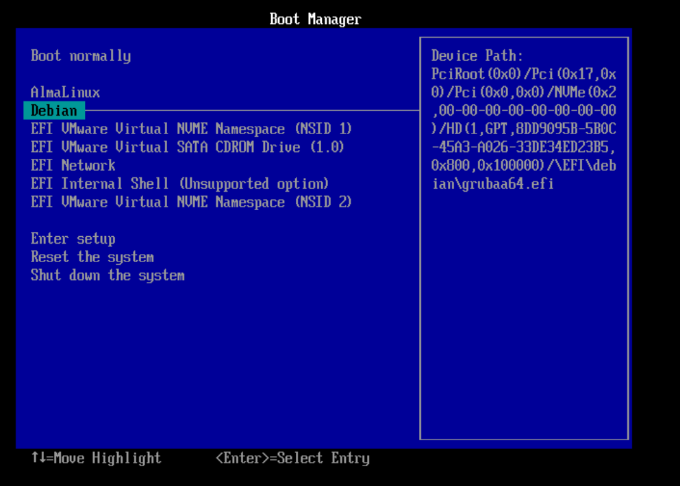

# Creant una Entrada d’Arrancada Personalitzada

La UEFI manté una taula d’arrancada que conté una llista d’entrades d’arrancada. Cada entrada correspon a un sistema operatiu o aplicació que pot ser arrancada per la UEFI. Per exemple, si tenim instal·lats els sistemes operatius AlmaLinux i Debian en la mateixa màquina, cada un tindrà la seva pròpia entrada d’arrancada a la taula d’arrancada de la UEFI.

Per crear una nova entrada d’arrancada per al sistema operatiu Debian, podem utilitzar la comanda `bcfg` de la consola UEFI. Aquesta comanda proporciona una interfície per gestionar la taula d’arrancada de la UEFI.

1. Reinicieu la màquina virtual i accediu a la consola UEFI.
2. Utilitzeu la comanda bcfg boot add per crear una nova entrada d’arrancada. Per exemple, per afegir una nova entrada amb el nom Debian i el fitxer BOOTAA64.EFI de la partició FS2, utilitzeu la següent comanda:

    ```bash
    bcfg boot add 6 fs2:\EFI\debian\grubaa64.efi Debian
    ```

    En aquesta comanda, 6 és el número de la nova entrada a la UEFI. Aquest número ha de ser únic i no pot ser repetit. Si ja tenim una entrada amb el número 3, haurem de canviar el número per un altre número que no estigui en ús. Per saber quins números estan en ús, podem utilitzar la comanda `bcfg boot dump`.

3. Un cop creada la nova entrada d’arrancada, podem voler canviar la seva posició a la llista d’arrancada. Per exemple, si volem que la nova entrada sigui la segona opció d’arrancada, podem utilitzar la comanda:

    ```bash
    bcfg boot mv 6 1
    ```

    En aquesta comanda, 6 és el número de l’entrada que volem moure, i 1 és la nova posició de l’entrada a la llista d’arrancada.

    > **✏️ Nota**:
    >
    > Els items es numeren de 0 a n-1, on n és el nombre d'entrades.

4. Ara tenim la entrada *AlmaLinux* i *Debian* a la UEFI. Podem sortir de la consola UEFI i reiniciar la màquina virtual. Ara, quan accedim a la consola UEFI, veurem dues opcions: AlmaLinux i Debian.



Amb aquesta configuració, podem seleccionar quin sistema operatiu volem arrancar directament des del menú d’arrancada de la UEFI, sense haver d’accedir a la consola UEFI.
