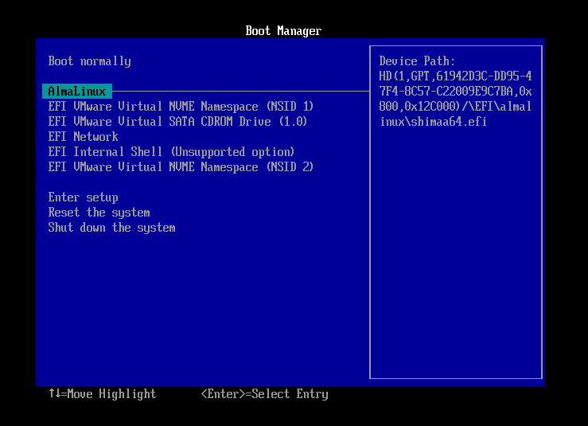
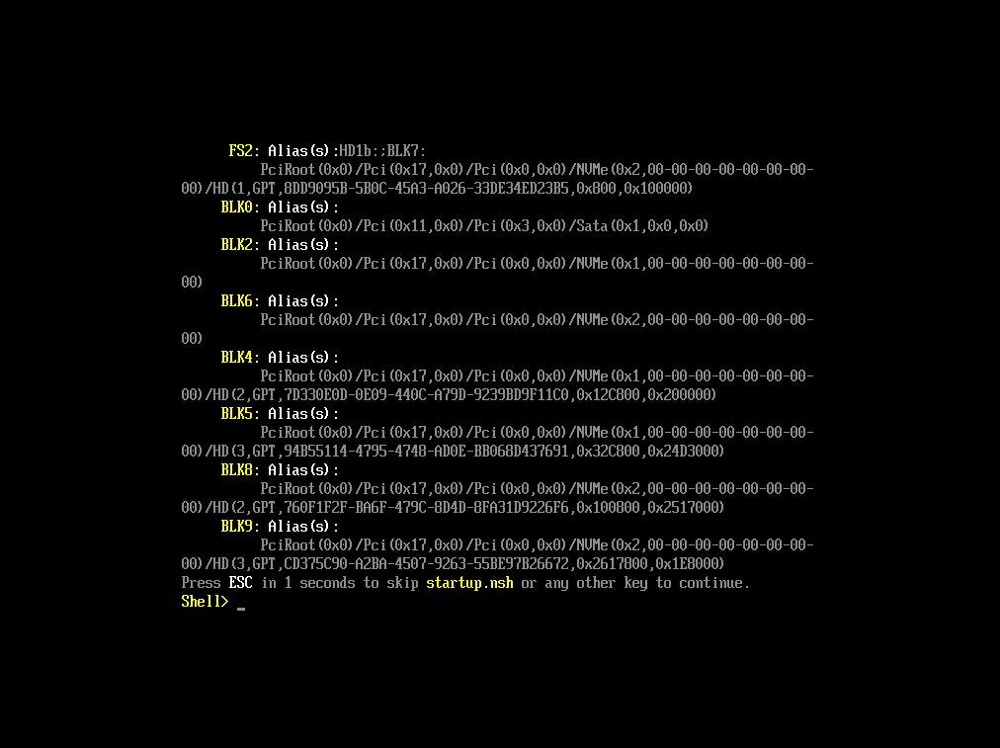

# Inciant la consola UEFI

Per accedir a la consola UEFI, seguiu aquests passos:

1. Inicieu la màquina virtual `VM1`.
2. Premeu la tecla ``ESC`durant l'arrencada de la màquina virtual per accedir a **Boot Manager**.

    

3. Seleccioneu EFI Internal Shell per accedir a la consola UEFI.

    

La consola UEFI és una interfície de text que permet interactuar amb el firmware de la màquina. El primer que necessiteu saber es com interactuar amb la consola. Per això, podeu utilitzar la comanda `help` per obtenir una llista de comandes disponibles.
