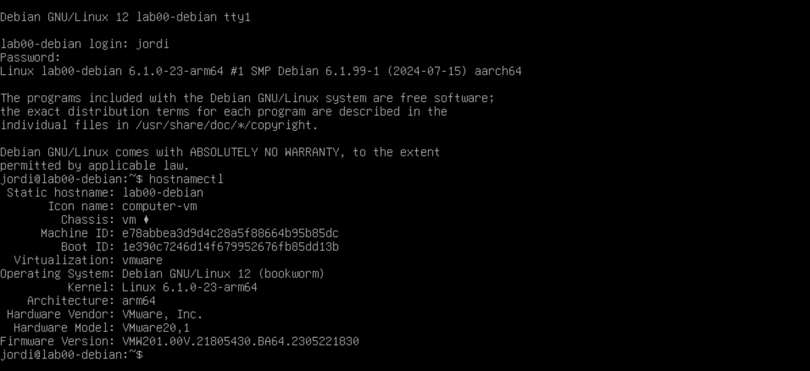

# Hostname

El administrador de sistemes acostumen a administrar múltiples servidors i dispositius. Per tant, és important identificar cada dispositiu amb un nom únic per facilitar la gestió i la comunicació entre ells. El nom d'un dispositiu s'anomena **nom d'amfitrió** o **hostname**. Per a gestionar el nom d'amfitrió d'un sistema Linux, utilitzarem la comanda `hostnamectl`.

## Comprovar el nom d'amfitrió actual

Per comprovar el nom d'amfitrió actual del vostre sistema, podeu utilitzar la comanda `hostnamectl`:

```bash
hostnamectl
```

Aquesta comanda us mostrarà informació sobre el vostre sistema, incloent el nom d'amfitrió actual.



A part del nom d'amfitrió, també podeu veure informació com la versió del sistema operatiu, el kernel, la data i l'hora actuals, etc.

## Modificar el nom d'amfitrió

Per canviar el nom d'amfitrió del vostre sistema, podeu utilitzar la comanda `hostnamectl` amb l'opció `set-hostname`. Per exemple, si voleu canviar el nom d'amfitrió a `nou-nom`, executeu la següent comanda:

```bash
hostnamectl set-hostname nou-nom
```

Aquesta comanda canviarà el nom d'amfitrió del vostre sistema a `nou-nom`. Si voleu comprovar que el canvi s'ha aplicat correctament, torneu a executar la comanda `hostnamectl`.  Per aplicar el canvi, sortiu de la sessió actual `exit` i torneu a iniciar sessió.


> 🔗 **Recordatori**:
>
> Cal tenir en compte que aquesta comanda requereix permisos d'administrador. Per tant, és possible que hàgiu de precedir la comanda amb `sudo` o executar-la com a usuari `root`.
