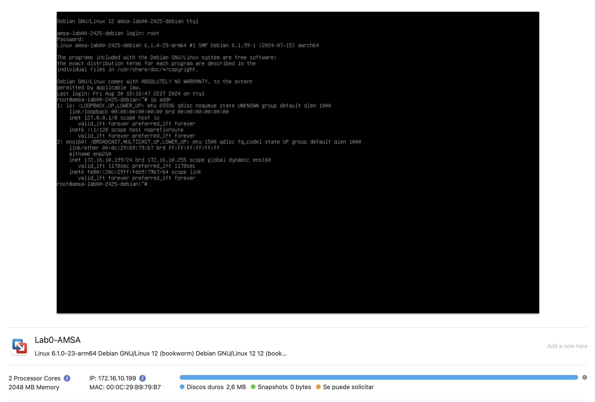
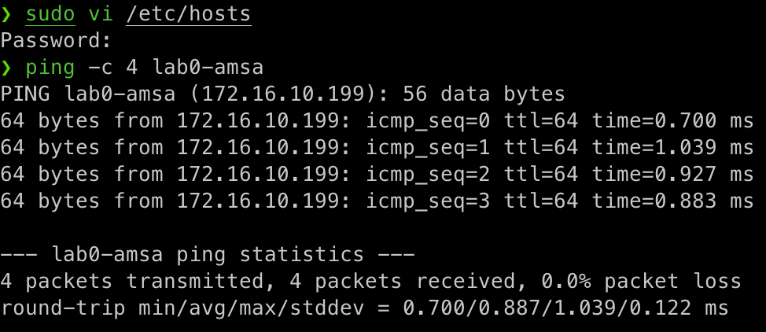

# Nom en xarxa

Hi ha dos maneres d'identificar un servidor o dispositiu connectat en una xarxa, o bé utilitzant la direcció IP del dispositiu o bé utilitzant el seu nom d'amfitrió. Per poder resoldre el nom d'amfitrió correctament, cal configurar-lo correctament en el sistema o disposar d'un servidor DNS que pugui resoldre el nom d'amfitrió en una adreça IP.

## Network Address Translation (NAT)

Per defecte, VMWare utilitza una xarxa NAT per connectar les màquines virtuals. Per fer-ho, VMWare crea una xarxa privada a la qual es connecten les màquines virtuals i utilitza la xarxa de l'amfitrió per connectar-se a Internet. Això permet a les màquines virtuals connectar-se a Internet a través de l'amfitrió sense necessitat de configurar una xarxa addicional. Ara bé, això també significa que les màquines virtuals utilitzen una adreça IP privada que no és accessible des de l'exterior. Tot i això, aquesta configuració la podeu canviar si cal. Però, pels nostres laboratoris, aquesta configuració és suficient.

> ℹ️ **Què és NAT?**
>
> La xarxa NAT (Network Address Translation) és una tècnica que permet a diversos dispositius connectar-se a Internet utilitzant una única adreça IP pública. Aquesta tècnica és àmpliament utilitzada per a xarxes domèstiques i petites empreses per permetre a diversos dispositius connectar-se a Internet sense necessitat de disposar d'una adreça IP pública per a cada dispositiu.

## Ús de la direcció IP

La direcció IP és una forma única d'identificar un dispositiu en una xarxa. Cada dispositiu connectat a una xarxa ha d'estar configurat amb una adreça IP única per poder comunicar-se amb altres dispositius. Les adreces IP poden ser dinàmiques (assignades per un servidor DHCP) o estàtiques (configurades manualment).

Quan es crea una màquina virtual utilitzant el programari VMWare per defecte, la màquina virtual obté una adreça IP a través del servidor DHCP de VMWare. Aquesta adreça IP es pot utilitzar per accedir a la màquina virtual des de l'amfitrió o altres dispositius de la xarxa.

Per obtenir aquesta informació podeu consultar la interficie gràfica de VMWare o bé utilitzar la comanda `ip addr` en la terminal de la màquina virtual.

- Interfície gràfica de VMWare:

  

- Comanda `ip addr`:

  ```bash
  ip addr
  ```

  Aquesta comanda us mostrarà la informació de la interfície de xarxa de la màquina virtual, incloent la seva adreça IP.

  

Podeu testar la connectivitat de la màquina virtual amb l'amfitrió o altres dispositius de la xarxa utilitzant la comanda `ping`. Per exemple, per provar la connectivitat amb l'amfitrió, podeu utilitzar la següent comanda:

```bash
ping -c 4 <adreça IP de l'amfitrió>
```


## Ús del nom d'amfitrió

El nom d'amfitrió és una forma més fàcil de recordar i identificar un dispositiu en una xarxa. En lloc d'utilitzar una adreça IP, podeu utilitzar un nom d'amfitrió per connectar-vos a un dispositiu. Per exemple, en lloc de connectar-vos a `172.16.10.199`, podeu connectar a `lab0-amsa`.

Per fer-ho, cal modificar la configuració del vostre ordinador local perquè pugui resoldre el nom d'amfitrió correctament. Això es pot fer afegint una entrada al fitxer `/etc/hosts` amb el nom d'amfitrió i la seva adreça IP. Per exemple afegint la següent línia al fitxer `/etc/hosts`:

```bash
# /etc/hosts
172.16.10.199 lab0-amsa
```

- Windows: `C:\Windows\System32\drivers\etc\hosts`
- Linux: `/etc/hosts`
- macOS: `/etc/hosts`

Un cop afegida aquesta entrada, podeu provar la connectivitat amb la màquina virtual utilitzant el nom d'amfitrió:

```bash
ping -c 4 lab0-amsa
```



Una forma alternativa de resoldre el nom d'amfitrió és utilitzar un servidor DNS. Un servidor DNS és un servidor que tradueix els noms d'amfitrió en adreces IP i viceversa. Aquest és el cas de la majoria de xarxes corporatives i d'Internet, on es fa servir un servidor DNS per resoldre els noms de domini.
